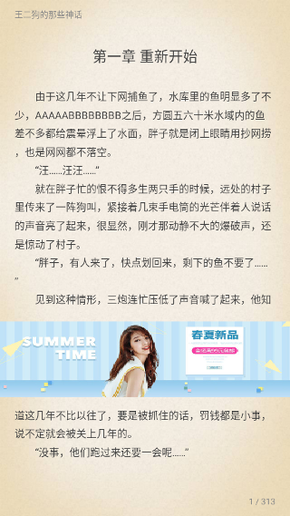
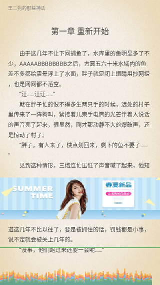

# TxtView

TxtView 目标是打造一款高性能的 TXT 阅读渲染视图，即使是在低端手机也能流畅如丝。

体验地址：[点击下载](release/)


## 功能

- 核心就是要快：加载快，渲染快，后续会不断优化
- 智能分页
- 手势回调
- 支持嵌入广告位

## 效果图





## NEXT PLAN

- 使用 Builder 模式友好化 TxtView 的使用
- 导入大文件 TXT 处理
- 备注功能

## 使用说明

> 后续会提交到 bintray 或者 jitpakc 仓库

#### 第一步，布局中嵌入 TxtView

```xml
<com.jayfeng.txtview.TxtView
    android:id="@+id/contentView"
    android:layout_width="wrap_content"
    android:layout_height="match_parent"
    android:layout_above="@id/bottom_bars"
    android:background="@drawable/theme_leather_bg" />
```

#### 第二步，设置 TxtView 属性

```kotlin
// 设置文本内容
contentView.setContent(sb.toString())
// 设置广告图片
contentView.mAdBitmap = (resources.getDrawable(R.drawable.ad) as BitmapDrawable).bitmap
// 设置手势回调
contentView.mPageTouchLinstener = object : PageTouchLinstener {
    override fun onClick(touchType: TouchType, page: Page) {
        Log.d("feng", "touch type: ${touchType.name}")
        when (touchType) {
            TouchType.AD -> {
                Toast.makeText(this@MainActivity, "您点击了广告位置", Toast.LENGTH_SHORT).show()
            }
            TouchType.LEFT -> {
                contentView.prevPageWithAnim()
            }
            TouchType.RIGHT -> {
                contentView.nextPageWithAnim()
            }
            TouchType.CENTER -> {
                Toast.makeText(this@MainActivity, "点击中部区域，显示菜单", Toast.LENGTH_SHORT).show()
            }
            else -> {
            }
        }
    }
}
```

后面会逐步开放接口，完善文档。

## 贡献

欢迎高手或者阅读器内行指点留言，能把优化工作再进一步。
