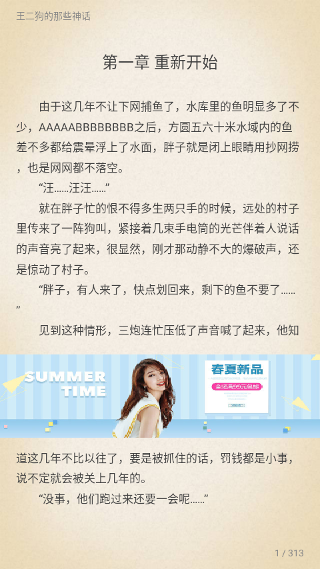
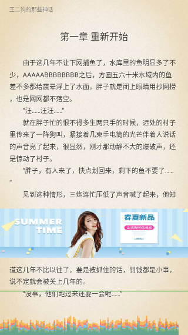

# TxtView

TxtView 目标是打造一款高性能的 TXT 阅读渲染视图，即使是在低端手机也能流畅如丝。

体验地址：[点击下载](release/)

## 功能

- 核心就是要快：加载快，渲染快，后续会不断优化
- 智能分页
- 手势回调

## 效果图

## NEXT PLAN

- 嵌入广告
- 使用 Builder 模式友好化 TxtView 的使用
- 导入大文件 TXT 处理
- 备注功能