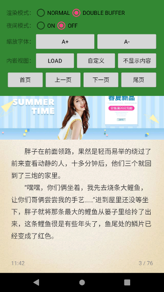

# TxtView

TxtView 目标是打造一款高性能的 TXT 阅读渲染视图，即使是在低端手机也能顺滑如丝。

体验地址：[点击下载](release/)


## 功能

- 核心就是要快：加载快，渲染快，后续会不断优化
- 支持阅读器常规特性：背景、夜间模式、字体缩放
- 智能分页
- 手势回调
- 支持嵌入广告位
- 支持双缓冲模式（内存换性能）
- 支持内嵌视图：加载视图、自定义视图等


## 效果图




## NEXT PLAN

- 阅读记录
- 设置字体
- 导入大文件 TXT 处理
- 备注功能

## 使用说明

> 后续会提交到 bintray 或者 jitpakc 仓库

#### 第一步，布局中嵌入 TxtView

```xml
    <com.jayfeng.txtview.TxtView
        android:id="@+id/txtView"
        android:layout_width="match_parent"
        android:layout_height="match_parent"
        android:textColor="@android:color/white">

        <!-- txtViewLoadingView 为固定ID不能修改。代表加载视图 -->
        <TextView android:id="@+id/txtViewLoadingView"
            android:layout_width="wrap_content"
            android:layout_height="wrap_content"
            android:padding="16dp"
            android:textSize="24sp"
            android:text="正在加载..."/>

    </com.jayfeng.txtview.TxtView>
```

#### 第二步，设置 TxtView 属性

```kotlin
// TxtViewBuilder 配置参数
txtViewBuilder.setRenderMode(RenderMode.DOUBLE_BUFFER)
    .setTitle("我是设置的标题")
    .setBackgroudDrawable(R.drawable.theme_leather_bg)
    .setContentPainter(contentPaint)
    .build()

// 设置文本内容
txtView.setContent(sb.toString())
// 设置广告图片
txtView.mAdBitmap = (resources.getDrawable(R.drawable.ad) as BitmapDrawable).bitmap
// 设置手势回调
txtView.mPageTouchLinstener = object : PageTouchLinstener {
    override fun onClick(touchType: TouchType, page: Page) {
        when (touchType) {
            TouchType.AD -> {
                Toast.makeText(this@MainActivity, "您点击了广告位置", Toast.LENGTH_SHORT).show()
            }
            TouchType.LEFT -> {
                txtView.prevPageWithAnim()
            }
            TouchType.RIGHT -> {
                txtView.nextPageWithAnim()
            }
            TouchType.CENTER -> {
                Toast.makeText(this@MainActivity, "点击中部区域，显示菜单", Toast.LENGTH_SHORT).show()
            }
            else -> {
            }
        }
    }
}
// loading 视图点击
txtViewLoadingView.setOnClickListener {
    Toast.makeText(this@MainActivity, "点击了 LoadingView", Toast.LENGTH_SHORT).show()
}
```

后面会逐步开放接口，完善文档。

## 接口
| 类 | 方法 | 说明 | 备注 |
| - | - | - | - |
| TxtView | setContent(content: String) | 返回配置的加载视图 | |
| TxtView | prevPage() | 上一页 | |
| TxtView | nextPage() | 下一页 | |
| TxtView | gotoPage(pageIndex: Int) | 跳转到某一页 | pageIndex 从 1 开始计数|
| TxtView | firstPage() | 首页 | |
| TxtView | lastPage() | 尾页 | |
| TxtView | prevPageWithAnim() | 上一页（带动画） | |
| TxtView | nextPageWithAnim() | 下一页（带动画） | |
| TxtView | getLoadingView() : View? | 返回配置的加载视图 | |
| TxtView | showLoading() | 显示加载视图 | |
| TxtView | showCustomView(clearContent: Boolean) | 显示自定义视图 | clearContent 标识是否隐藏文字内容|
| TxtView | hideCustomView() | 隐藏视图 | |
| TxtView | release() | 释放资源 | |

## 贡献

欢迎高手或者阅读器内行指点留言(QQ： 673592063)，能把优化工作再进一步。
